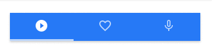

# morph-ripple

[](https://opensource.org/licenses/Apache-2.0) [](https://www.webcomponents.org/element/PolymerElements/paper-progress)

General ripple animation element for Polymorph Components

## Getting Started

For the information about how to clone the desired repository, running the local server and testing, please refer to Polymorph elements getting started docs at the end of this repository.

## Demo

<!---
```
<custom-element-demo>
  <template>
    <script src="../webcomponentsjs/webcomponents-lite.js"></script>
    <link rel="import" href="../morph-shared-colors/morph-shared-colors.html">
    <link rel="import" href="../morph-shared-styles/morph-shared-styles.html">
    <link rel="import" href="../morph-button/morph-button.html">
    <link rel="import" href="morph-ripple.html">
    <style>
      .ripple-wrapper {
        position: relative;
        width: 90%; 
        height: 70px;
        border: 1px solid #ccc;
        padding: 10px;
      }
    </style>
    <next-code-block></next-code-block>
  </template>
</custom-element-demo>
```
-->

```html

<div class="ripple-wrapper">
  <p>Click me!</p>
  <morph-ripple></morph-ripple>
</div>
<p>morph-ripple is built-in on morph-button. It automatically add ripple effect when it detects an android device</p>
<morph-button platform="android" filled big>Android Button</morph-button>

```

- Morph-ripple demo on other elements.

  <p align="center">
    
  </p>

  ```html

  <template>
    <h3>Android morph-tabbar demo</h3>
    <morph-tabbar platform="android" selected="play">
      <morph-tabbar-item platform="android" name="play" not-selected-image="../img/play_android.svg" selected-image="../img/play_android_selected.svg"></morph-tabbar-item>
      <morph-tabbar-item platform="android" name="favorite" not-selected-image="../img/favorite_android.svg" selected-image="../img/favorite_android_selected.svg"></morph-tabbar-item>
      <morph-tabbar-item platform="android" name="mic" not-selected-image="../img/mic_android.svg" selected-image="../img/mic_android_selected.svg"></morph-tabbar-item>
    </morph-tabbar>
  </template>

  ```

- The code below shows how we use it inside the elements.


  <p align="center" >
    
  </p>

  ```html

  <a href$="[[link]]" target$="[[target]]" rel$="[[relation]]">
    <slot></slot>
    <morph-ripple></morph-ripple>
  </a>

  ```

## Styling

Custom property                  | Description                            | Default
---------------------------------|----------------------------------------|--------------------
`--ripple-color`                 | Color of the ripple                    | #2196f3

## Further help

For more information on how to install and run test please go here - [Polymorph elements getting started]

[Polymorph elements getting started]: https://github.com/moduware/polymorph-components/blob/master/INFO.md
